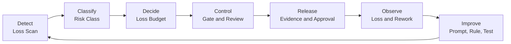

# Vibe Compression Overview

AI支援開発で短くなった時間の中から、  
**何が保持され、何が失われたのかを検知・分類・制御・計測する**ための運用モデルです。

> Version: v0.1.0  
> Status: Working hypothesis

## Problem

生成AIは、調査、設計、実装、テスト、文書化などの作業を高速化します。

しかし、生成速度が上がったことと、仕事全体が適切に完了したことは同じではありません。

次のような状態が起こり得ます。

- コードは速く生成されたが、レビュー時間が増えた
- 正常系は動くが、異常系や認可が抜けた
- ローカルでは動くが、運用環境では追跡できない
- 実装量は増えたが、設計の一貫性が低下した
- 初回の成果物は早く出たが、後工程の手戻りが増えた
- AIが補完した前提を、人間が確認しないまま採用した

Vibe Compressionは、「AIは速いか、遅いか」ではなく、次を問います。

> 短くなった時間の中で、何を保持し、何を意図的に省略し、何を無自覚に失ったのか。

---

## Compression and Truncation

### Compression

必要な価値を保持したまま、時間、認知負荷、待ち時間、手戻りを減らすことです。

すべてを完全に残すという意味ではありません。

低リスクな試作では、UIの細部や一部の文書を後回しにする判断もあり得ます。

重要なのは、次が明示されていることです。

- 何を必ず保持するか
- 何を省略してよいか
- 誰がその判断をしたか
- どの条件で停止するか
- 後からどう検証するか

### Truncation

何を失ったかに気づかないまま起きる、無自覚な切り捨てです。

例：

- 認可境界が実装されていない
- 外部API障害時の挙動がない
- リトライによる二重実行を考慮していない
- ログはあるが、処理を追跡できない
- 過去に同じ箇所で起きた障害をAIが知らない
- 業務用語の定義が部門ごとに異なる
- 誰がリスクを承認したのか記録されていない

Truncationの問題は、単にバグが存在することではありません。

**何が落ちたかを、チームが認識できないこと**です。

---

## Core Loop

Vibe Compressionの最小ループは次の通りです。

### 1. Detect

[Loss Scan](../loss-scan/README.md)で、AIに任せることで失われやすい価値を確認します。

### 2. Classify

変更の影響を、Low / Medium / High / Criticalなどのリスク段階に分類します。

### 3. Decide

保持必須の価値、許容する省略、停止条件を決めます。

### 4. Control

必要に応じて、レビュー、テスト、CI/CD gate、権限分離、承認を設定します。

### 5. Release

未解決リスク、例外、承認者、ロールバック方法を記録します。

### 6. Observe

手戻り、障害、レビュー指摘、運用上の問題をLossとして記録します。

### 7. Improve

発見したLossを、次のAI指示、テスト、ルール、テンプレート、設計へ戻します。

---

## Loss Categories

最初から完全な分類体系を作る必要はありません。

まずは、次のようなカテゴリから始めます。

### Context Loss

AIが、業務ルール、過去の障害、既存設計の理由、顧客固有の事情を知らない。

### Delegation Loss

人間が「AIが生成したから大丈夫」と考え、差分確認や判断を浅くする。

### Integration Loss

単体では動くが、認証、設定、データ、外部依存、運用環境との接続で崩れる。

### Observability Loss

壊れたときに、検知、追跡、調査、説明ができない。

### Tool-Action Loss

AI agentによるファイル変更、コマンド実行、外部API操作の意図や証跡が残らない。

### Accountability Loss

誰が何を判断し、承認し、例外として認めたのかが分からない。

分類は固定ではありません。

実際に発生したLossに基づいて更新します。

---

## Minimum Adoption Path

大きな組織変革として始める必要はありません。

### Day 1

AIへ依頼する前に、Loss Scanの3問を使います。

### Week 1

レビュー指摘と手戻りについて、どのLossが発生したかを記録します。

### Week 2

影響の大きい変更だけ、必須レビュー、追加テスト、承認条件を設定します。

### Month 1

発生したLossを見直し、AI指示、テスト、ルール、チェックリストを更新します。

厳密な制度を先に作るのではなく、  
**実際に見えるようになったLossから制御を追加する**ことを推奨します。

---

## Relationship to Loss Scan

Loss Scanは、Vibe Compressionの入口です。

3つの質問で、最も壊れやすい場所を短時間で探します。

ただし、Loss Scanだけでは次を保証できません。

- リスクが正しく分類された
- 必要なレビューが行われた
- 本番操作が安全に制御された
- 例外承認が記録された
- 障害を検知できる
- 手戻りが実際に減った

そのため、重要な変更では、Loss Scanをgate、owner、test、evidenceへ接続します。

---

## Relationship to Decision-Ready Slice

[Decision-Ready Slice Full Worksheet](../decision-ready-slice/README.md)は、実装より上流の意思決定を扱います。

両者の役割は異なります。

| Concept | Primary question |
|---|---|
| Decision-Ready Slice | 何を、誰が、どの根拠で判断するのか |
| Vibe Compression | AIに任せた開発で、何を保持し、何を失ったのか |
| Loss Scan | 委譲前に、どこが最も壊れやすいか |

Decision-Ready Sliceで、対象、判断、責任者、比較案を明確にします。

その後の実装・運用では、Vibe CompressionによってLossを検知・制御します。

---

## What to Measure

「AIを使ったら速くなった」という体感だけでは評価しません。

最低限、次を分けて記録します。

- 最初に利用可能な成果物ができるまでの時間
- 人間によるレビュー時間
- 手戻りに使った時間
- 障害や運用問題の修復時間
- 発見されたLossの種類と重大度
- Lossを発見した工程
- 後工程から前工程へ移せた指摘
- 追加したgateやテストのコスト

現時点では、単一の指標でVibe Compressionの成否を表せるとは考えていません。

---

## Current Hypotheses

このプレイブックは、次の仮説を持っています。

1. AI支援開発では、生成時間だけを測ると効果を過大評価しやすい
2. 委譲前にLossを言語化すると、レビュー指摘の一部を前倒しできる
3. リスクに応じて統制を変えれば、低リスク作業まで重くする必要はない
4. 発生したLossを次の指示・テスト・ルールへ戻すことで、運用モデルは改善する
5. 成功事例だけでなく、形骸化や適用不能条件の記録が必要である

これらはまだ普遍的な事実ではありません。

実践と反証によって更新します。

---

## Known Risks

Vibe Compression自体にも失敗パターンがあります。

- 新しい用語を増やしただけで、現場の行動が変わらない
- Loss Scanが形式的なチェック欄になる
- すべてをHigh riskとして扱い、開発を遅くする
- gateを増やすことが目的になる
- 測定コストが効果を上回る
- 既存のレビューやセキュリティ活動と重複する
- 「AIが原因」という説明で、人間の設計責任を曖昧にする

これらが起きた場合は、導入範囲、用語、質問、運用方法を見直します。

---

## Planned Extensions

今後、次を追加する予定です。

- Risk Class
- Loss Budget
- PR Template
- Truncation Checklist
- Required Gates
- Owner and Evidence
- AI Agent Permission Levels
- Measurement Guide
- Completed Examples
- Experiment Logs

進行状況は[Project Roadmap](../../ROADMAP.md)を参照してください。

---

## Related Resources

- [Loss Scan Quick Start](../loss-scan/README.md)
- [Decision-Ready Slice Full Worksheet](../decision-ready-slice/README.md)
- [AI開発は「爆速」ではなく「圧縮」せよ](https://note.com/mogamin2/n/nbc1648594f91)
- [Project Roadmap](../../ROADMAP.md)
- [Repository README](../../README.md)

---

## Feedback

実践結果、失敗例、反論、改善案はGitHub Issuesで受け付けます。

顧客、案件、個人、システムを特定できる機密情報は投稿しないでください。

---

## Disclaimer

本資料は、セキュリティ、法令適合性、品質、安全性、投資効果を保証するものではありません。

対象システムのリスク、所属組織の規程、契約、法令、専門家の判断を優先してください。
